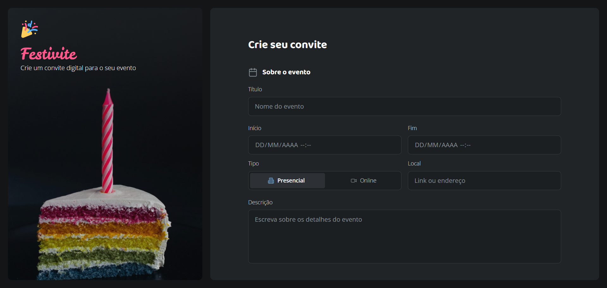
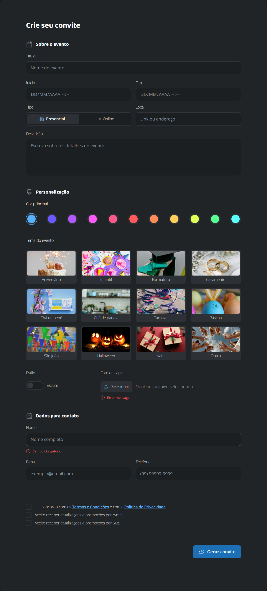

# 🎉 Festivite – Estudo de Estruturação e Estilização de Inputs

O **Festivite** é um projeto exclusivamente educacional, desenvolvido para praticar **estruturação de formulários em HTML** e **estilização avançada de inputs com CSS puro**.

> ⚠️ Este projeto não possui backend e não tem finalidade comercial.  
> O foco é apenas aprendizado de front-end.

## 🖼 Preview






## 📚 Objetivo do Projeto

Este projeto foi criado para estudar:

- Estruturação semântica de formulários em HTML
- Organização modular de CSS
- Customização visual de inputs:
  - `radio` — seletor animado e paleta de cores
  - `checkbox` — estilizado e toggle switch customizado
  - `file input` — botão de upload personalizado
  - `datetime-local` — estilização do campo de data
  - `textarea` — redimensionamento e foco
- Uso de variáveis CSS (`:root`)
- Estados de validação (`:invalid`, `:focus`, `:checked`, `:placeholder-shown`)
- Uso do seletor moderno `:has()`
- Layout com **CSS Grid** e **Flexbox**


## 🛠 Tecnologias Utilizadas


- HTML5 semântico
- CSS3 puro (sem frameworks)
- CSS Grid e Flexbox
- CSS Custom Properties (variáveis)


## 📂 Estrutura do Projeto

```
📁 assets/
📁 styles/
│   ├── global.css
│   ├── aside.css
│   ├── main.css
│   └── input.css
📄 index.html
📄 index.css
```


## 🚀 Como Visualizar

1. Clone o repositório:

```bash
git clone <url-do-repositorio>
```

2. Abra o arquivo `index.html` no navegador.

Não é necessário instalar dependências.


## 🎯 O Que Está Sendo Praticado

O formulário simula a criação de um convite digital, servindo como contexto visual para explorar conceitos de front-end.

**Estrutura de Formulário**
- Uso correto de `fieldset` e `legend`
- Associação adequada entre `label` e `input`
- Organização com Grid e Flexbox

**Estilização Avançada**
- Radio buttons personalizados com animação deslizante
- Toggle switch customizado com transição suave
- Checkboxes estilizados com ícone SVG
- Upload de arquivo com botão e status customizados
- Feedback visual de erro com `:invalid` e `:has()`
- Foco personalizado em todos os inputs
- Paleta de cores interativa via variáveis CSS


## 📌 Observações

Este projeto **não possui**:

- Banco de dados
- Integração com backend
- Envio real de formulário
- Lógica JavaScript

Desenvolvido **somente para estudo de estruturação e estilização de inputs com HTML e CSS**.
